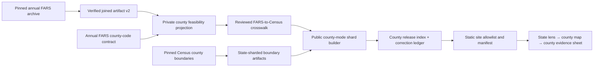

# County drill-down implementation plan

**Status:** Proposed implementation program

**Drafted:** 2026-07-18

**Decision:** Proceed with a proof-first pilot; authorize nationwide UI work only
after the pilot's accounting, geography, suppression, and user-value gates pass.

**Related decisions:**
[`adr/0014-county-fars-context-requires-a-verified-public-projection.md`](adr/0014-county-fars-context-requires-a-verified-public-projection.md),
[`STATE-MAP-DRILLDOWN-PLAN.md`](STATE-MAP-DRILLDOWN-PLAN.md), and
[`PRODUCT-EXPANSION-PLAN.md`](PRODUCT-EXPANSION-PLAN.md).

## 1. Executive recommendation

County drill-down is worth pursuing, conditionally.

The state lens answers, “What does the reviewed fatal-crash record show for this
state?” The next natural and materially useful question is, “Where within this
state is that published burden recorded?” County context can help an advocate,
planner, researcher, or journalist identify the county-equivalent associated with
a reviewed count, compare counties using the same mode and year, and carry a
source-qualified number into a brief.

This becomes a distinctive NearMiss capability only if the data contract is the
feature. A merely zoomable county map would look useful while encouraging users
to interpret raw counts as local risk. The recommended product instead binds
every visible county cell to:

- a verified annual FARS joined artifact;
- an explicit source-year county-code system;
- a versioned FARS-to-Census county-equivalent crosswalk;
- a pinned, hashed Census boundary vintage;
- state/mode reconciliation including every sentinel county bucket;
- a closed public schema that cannot carry an unpublished count; and
- the existing burden-not-risk and coding-regime claim boundaries.

Proceed in five decisions, not one large build:

1. **Feasibility:** prove county accounting from existing private joined
   artifacts for one difficult state and one ordinary state.
2. **Geography:** prove the source-code-to-GEOID presentation join and boundary
   topology independently of counts.
3. **Public contract:** publish no values until a state-sharded county artifact
   reconciles and suppression leakage is impossible by schema.
4. **Product pilot:** expose the verified pilot behind a non-default preview and
   test whether users answer a real county-level question correctly.
5. **National release:** expand year by year and state by state only after the
   pilot gates pass.

Recommended pilot states:

- **Virginia** for independent cities and county equivalents;
- **Alaska** for boroughs and census areas;
- **Louisiana** as a terminology/presentation fixture for parishes; and
- **California** as a familiar, high-volume control with ordinary counties.

The first two are the required adversarial pilots. California is the recommended
first end-to-end UI pilot because it is legible to users and provides enough
published cells to evaluate the interaction. Virginia must pass before any public
claim of nationwide geographic coverage.

## 2. Investment thesis

### 2.1 Why this could be valuable

County drill-down moves the Atlas closer to a useful public evidence product:

- **Stronger task fit.** State totals are often too coarse for local reporting,
  grant work, coalition organizing, and jurisdictional planning.
- **Better bridge to local evidence.** A county is coarse enough to publish
  responsibly but local enough to orient a user before they inspect a corridor,
  submission dataset, or Decision Dossier.
- **Clear differentiation.** NearMiss can expose not only a count, but the
  accounting and source contract that make the count defensible.
- **Reusable pipeline.** The county projection, crosswalk, and state-sharded
  geography become reusable infrastructure for annual releases and corrections.
- **Low operating complexity.** The existing static-hosting model can serve
  state shards without a database, map service, or new production runtime.

### 2.2 Why this might not be worth completing

Stop after the private pilot if any of the following is true:

- intended users cannot name a decision improved by county-level fatal-crash
  burden;
- users consistently read county counts as safety or exposure-normalized risk;
- annual county-code mappings require unresolved judgment that cannot be made
  explicit and reviewable;
- suppression leaves too few published cells for a useful county comparison in
  most states;
- the maintenance cost of annual crosswalk and boundary review exceeds the
  observed product value; or
- the county lens merely duplicates a better official NHTSA or state tool without
  adding NearMiss's claim-boundary and audit value.

### 2.3 Recommended investment envelope

Treat the work as a staged 8–12 week program for one primary maintainer, with a
go/no-go review after weeks 2–3. Do not commit the full timeline before the
feasibility pilot reports actual join coverage, sentinel accounting, and
publication density.

| Stage | Primary output | Indicative effort | Commitment |
| --- | --- | ---: | --- |
| Discovery and pilot accounting | Private feasibility report | 1–2 weeks | Approved to start |
| Crosswalk and geometry pilot | Reviewed Virginia/Alaska/California joins | 1–2 weeks | Conditional |
| Public artifact contract | State-sharded schema, builder, index, tests | 2–3 weeks | Conditional |
| County-lens preview | Accessible UI and deep links for pilot states | 2–3 weeks | Conditional |
| Nationwide expansion and release | Five years × 51 jurisdictions | 2–4 weeks | Go/no-go after preview |

The estimate excludes recruiting external usability and screen-reader
participants and excludes any exposure-denominator or rate work.

## 3. Problem statement

The public Atlas can now enter a state and explain selected-year and five-year
fatal-crash burden by involved mode. It cannot show whether the reviewed source
record is concentrated across different county equivalents within that state.
Users who need sub-state context must leave NearMiss, manually reconcile coding
systems, or infer locality from state totals.

The cost of doing nothing is limited but real: the state lens remains a strong
reference surface rather than a geographic research path. The cost of doing the
wrong thing is higher: a local-looking choropleth can be mistaken for risk,
hotspots, or intervention priority even when it shows unnormalized counts.

## 4. Product principles

1. **The evidence gets finer only when the proof gets finer.** Geometry never
   implies a geographic resolution absent from the public artifact.
2. **Burden is not risk.** No “dangerous,” “safe,” “hotspot,” “rate,” or priority
   claim appears without a separately reviewed exposure method.
3. **Unknown geography remains in the accounting.** `not_applicable`, `other`,
   `not_reported`, and `unknown` are buckets, not fabricated counties.
4. **Withheld means no value exists publicly.** A suppressed cell contains no
   numeric count in JSON, logs, DOM, SVG, CSS, ARIA, downloads, or telemetry.
5. **Modes remain independent and overlapping.** County mode cells are not
   stacked or summed.
6. **Annual contracts remain annual.** County-code systems and source releases
   are pinned by year and contract revision.
7. **The coding seam remains visible.** 2020–2021 and 2022–2024 are not rendered
   as one uninterrupted trend.
8. **Static artifacts remain the production boundary.** No client query reaches
   raw FARS rows or a live geospatial service.
9. **Correction is a first-class workflow.** A county release can be revised,
   indexed, audited, and retired without rebuilding unrelated state shards.

## 5. Goals and success criteria

### 5.1 User goals

1. At least 80% of pilot participants can open a named county from its state
   lens without instruction.
2. At least 80% can identify the active year, involved mode, county-equivalent,
   and publication status within 30 seconds.
3. At least 80% correctly explain that the value is a fatal-crash burden count,
   not exposure-normalized risk.
4. At least 80% correctly interpret a hatched county as “suppressed or zero; not
   numerically published,” not zero.
5. At least 70% can reopen a copied county URL and recover the same state,
   county, year, mode, language, and map level.

### 5.2 Data-quality goals

1. Every accepted `reported` FARS county code maps to exactly one reviewed Census
   county-equivalent GEOID or fails the build.
2. Every public GEOID maps to exactly one boundary feature or fails the build.
3. County contributions plus explicit non-reported buckets reconcile exactly to
   the state contribution total for every year × state × involved mode.
4. All public artifacts are deterministic: identical proof-bound inputs produce
   byte-identical canonical JSON.
5. No adversarial suppression test can recover a withheld numeric value from any
   public payload or rendering seam.

### 5.3 Operational goals

1. A one-state selected-year shard is usable within 1 second at p75 after state
   lens activation on a typical mobile connection.
2. County selection from an already-loaded state shard updates within 100 ms.
3. A corrected state/year shard can be rebuilt, indexed, reviewed, and deployed
   without changing other county shards.
4. Production verification proves the deployed manifest and critical county
   artifacts match the merged commit.

## 6. Non-goals

- **Crash points.** Event coordinates, case IDs, dates, and raw rows remain
  private and never enter this product.
- **Risk or rate mapping.** Population, vehicle miles, trips, walking/cycling
  exposure, and modeled denominators require a separate methods program.
- **Hotspot detection.** A county choropleth is not a spatial cluster analysis.
- **Treatment recommendations.** County burden does not establish causality or
  intervention effectiveness.
- **City, tract, ZIP, road, or corridor drill-down.** These need different source
  and geography contracts.
- **Live map infrastructure.** No Mapbox account, vector-tile server, database,
  or geospatial API is required for v1.
- **Cross-county additive totals in the UI.** Suppressed values make arbitrary
  user-selected sums misleading and potentially disclosive.
- **Puerto Rico.** The existing audited national contract covers the 50 states
  and DC; Puerto Rico remains a separately verified future source.
- **One continuous five-year county trend.** The evidence seam remains
  structural.

## 7. Target users and primary decisions

### 7.1 Safe-streets advocate

- As an advocate, I want to identify the published county-equivalent burden for
  my involved mode so that I can accurately frame the official context around a
  local near-miss campaign.
- As an advocate, I want the caveat and source to travel with a saved county so
  that a brief does not turn a count into a risk claim.

### 7.2 Planner or engineer

- As a planner, I want county counts on an independent same-mode scale so that I
  can see geographic burden without combining overlapping road-user modes.
- As a planner, I want non-reported county contributions accounted for so that I
  can judge how complete the geographic projection is.

### 7.3 Researcher or journalist

- As a researcher, I want a versioned artifact and crosswalk digest so that I can
  reproduce the county identity used in the view.
- As a journalist, I want suppressed cells to be explicitly unpublished so that
  I do not report a fabricated zero.

### 7.4 Keyboard and screen-reader user

- As a keyboard user, I want one predictable county-map tab stop, arrow
  navigation, county search, and explicit enter/leave behavior.
- As a screen-reader user, I want a full county data table and announced
  selection state without traversing every SVG feature.

### 7.5 Named decisions the pilot should validate

The research script must ask participants to name a real decision, such as:

- which county's official context belongs in a grant narrative;
- which county to investigate with local exposure or near-miss data next;
- whether a statement about a county can be supported by the reviewed FARS
  record;
- which county artifact and annual contract a published value came from; or
- whether two counties can be described as different in burden while avoiding a
  safety or causal claim.

“It is interesting to explore” is not sufficient validation.

## 8. Source and geography decisions

### 8.1 FARS source of truth

Reuse the proof-bound annual joined artifacts already produced through
`src/nearmiss/joined_outcome_artifacts_v2.py` and annual contracts in
`src/nearmiss/fars_year_contracts.py`.

Each private record already carries:

```text
source_record_id
state_code
state_code_system
county_code          # exactly three digits
county_status        # reported | not_applicable | other | not_reported | unknown
county_code_system   # nhtsa_fars_gsa_<year>
involved_modes
```

The sentinel contract is already explicit:

| County code | Private status | Public treatment |
| --- | --- | --- |
| `000` | `not_applicable` | Accounting bucket only |
| `997` | `other` | Accounting bucket only |
| `998` | `not_reported` | Accounting bucket only |
| `999` | `unknown` | Accounting bucket only |
| Other three-digit code | `reported` | Crosswalk candidate |

No sentinel becomes a county identity or geometry feature.

### 8.2 Boundary source

Pin the U.S. Census Bureau county-and-equivalent Cartographic Boundary File,
using the same basic pattern as `tools/build_us_state_boundaries.py`.

Recommended initial source:

```text
https://www2.census.gov/geo/tiger/GENZ2024/kml/cb_2024_us_county_20m.zip
```

The 1:20,000,000 file is the recommended first UI artifact because the county map
is orientation rather than parcel-accurate analysis. Evaluate 1:5,000,000 only
if small or coastal county equivalents become illegible at supported viewports.
Any resolution change creates a new geometry contract and digest.

The builder must retain and validate at least:

```text
STATEFP
COUNTYFP
GEOID = STATEFP + COUNTYFP
NAME
NAMELSAD, where available
geometry
```

Census defines county GEOID as the concatenation of two-character state FIPS and
three-character county FIPS. County-equivalent terminology includes Alaska
boroughs/census areas, Louisiana parishes, DC, and independent cities in several
states. The public display must use reviewed Census names, not append “County”
unconditionally.

### 8.3 Boundary vintage policy

Use one presentation vintage for the initial five-year product unless a source
year cannot be mapped unambiguously. Record the choice as a presentation
contract, not a claim that 2024 geometry existed unchanged in 2020.

Required metadata:

- Census vintage and legal-effective date;
- distribution URL;
- raw ZIP SHA-256 and byte length;
- archive member name and member digest;
- conversion and coordinate-rounding rules;
- simplification algorithm and tolerance, if any;
- retained jurisdictions and exclusions;
- feature count and geometry-type counts; and
- builder version.

If an annual county identity changed, the crosswalk must encode the mapping and
its review note. Do not silently coerce an old source code into a modern GEOID.

## 9. Proposed architecture



### 9.1 New modules

Recommended source layout:

```text
src/nearmiss/fars_county_feasibility.py
src/nearmiss/fars_county_crosswalk.py
src/nearmiss/fars_county_context.py
src/nearmiss/fars_county_public_index.py
tools/build_fars_county_feasibility.py
tools/build_fars_county_crosswalk.py
tools/build_us_county_boundaries.py
tools/export_fars_county_context.py
tools/build_fars_county_public_index.py
schema/private-fars-county-feasibility.schema.json
schema/fars-county-crosswalk.schema.json
schema/public-fars-county-context.schema.json
schema/public-fars-county-context-index.schema.json
schema/us-county-boundaries.schema.json
tests/test_fars_county_feasibility.py
tests/test_fars_county_crosswalk.py
tests/test_us_county_boundaries.py
tests/test_fars_county_context.py
tests/test_fars_county_public_index.py
web/us_coverage_check.mjs
```

Keep the private feasibility report outside `data/published/`. Public build and
site-assembly code must reject private artifact types and paths.

### 9.2 Static artifact layout

Recommended public paths:

```text
data/published/fars-county-mode-index-v1.json
data/published/fars-county-release-corrections.json
data/published/counties/us-counties-2024-index.json
data/published/counties/06.json                 # California geometry
data/published/counties/51.json                 # Virginia geometry
data/published/fars/2024/counties/06-r1.json    # California values
data/published/fars/2024/counties/51-r1.json    # Virginia values
```

State shards prevent a user opening California from downloading all national
county values and geometry. They also isolate corrections and keep the existing
static allowlist tractable.

### 9.3 Client loading sequence

1. State lens renders from the existing state artifact.
2. The user explicitly activates “Explore counties.”
3. The client resolves the state/year entry from the verified county index.
4. Geometry and the selected-year county shard load in parallel.
5. Both payloads are verified against index SHA-256 and byte length before use.
6. The state-level evidence remains usable during loading.
7. The county map renders only after exact GEOID-set parity succeeds.
8. Selecting a county renders selected-year evidence immediately.
9. Remaining annual shards load through deduplicated promises for the five-year
   profile.
10. A failed historical shard creates a partial profile, not a blank selected-year
    county lens.

## 10. Private feasibility artifact

### 10.1 Purpose

The feasibility artifact answers whether county publication is supportable before
any public data or UI exists. It retains sensitive accounting totals and remains
private.

### 10.2 Proposed schema

```json
{
  "schema_version": "1.0.0",
  "artifact_type": "nearmiss.private.fars_county_feasibility",
  "visibility": "private",
  "dataset_year": 2024,
  "source_lineage": {
    "joined_artifact_sha256": "…",
    "county_code_system": "nhtsa_fars_gsa_2024",
    "contract_revision": 2
  },
  "method": {
    "contribution_unit": "distinct_crash_once_per_involved_mode",
    "modes": ["…six canonical modes…"]
  },
  "states": [
    {
      "state_code": "51",
      "reported_county_codes": ["003", "005"],
      "sentinel_case_counts": {
        "not_applicable": 0,
        "other": 1,
        "not_reported": 0,
        "unknown": 0
      },
      "cells": [
        {
          "county_code": "003",
          "involved_mode": "pedestrian",
          "crash_count": 12
        }
      ],
      "reconciliation": {
        "reported_contribution_total": 100,
        "sentinel_contribution_total": 2,
        "state_contribution_total": 102,
        "matches_state_projection": true
      }
    }
  ]
}
```

The exact schema should remain closed, size-bounded, canonically ordered, and
bound to the source artifact digest. Case identifiers must not be copied into the
feasibility report; reconciliation can be performed during construction.

### 10.3 Aggregation algorithm

For every verified annual joined record:

1. Validate year, state-code system, county-code system, county status, and mode
   summary through the existing joined-artifact validator.
2. For each involved mode, add at most one contribution for that crash.
3. If `county_status == reported`, accumulate by `(state_code, county_code,
   involved_mode)`.
4. Otherwise accumulate by `(state_code, county_status, involved_mode)`.
5. Independently accumulate the state/mode contribution total.
6. Require reported-county plus sentinel contributions to equal that state/mode
   total exactly.
7. Require the resulting state/mode total to equal the input used by the existing
   state public projection.

The builder must be deterministic under input ordering and reject duplicate
source identities before aggregation.

### 10.4 Feasibility report metrics

Report privately, by year and state:

- number of distinct reported county codes;
- number of codes missing from the proposed crosswalk;
- cases and contributions in each sentinel class;
- positive candidate cells;
- cells at or above candidate publication floors;
- positive cells below each candidate floor;
- expected public cell density by mode;
- reconciliation status; and
- any identity change requiring human review.

Evaluate `k=10` first to match the state product. The methods review may recommend
a higher county floor because smaller geographic cells are less stable. A lower
floor should not be assumed merely because FARS data is public.

## 11. FARS-to-Census crosswalk contract

### 11.1 Why the crosswalk is separate

FARS county codes are source-native and annual. Census GEOIDs are presentation
identities tied to a geography vintage. Concatenating codes without a reviewed
contract would conceal annual changes and special cases.

### 11.2 Proposed crosswalk row

```json
{
  "dataset_year": 2024,
  "county_code_system": "nhtsa_fars_gsa_2024",
  "state_code": "51",
  "county_code": "760",
  "presentation_vintage": 2024,
  "state_fips": "51",
  "county_fips": "760",
  "geoid": "51760",
  "name": "Richmond city",
  "entity_class": "independent_city",
  "mapping_status": "exact",
  "review_note": "Direct annual code-to-current county-equivalent mapping"
}
```

### 11.3 Crosswalk invariants

- Unique source key: `(dataset_year, state_code, county_code)`.
- Unique presentation key within a year/state: `(dataset_year, geoid)` unless an
  explicitly reviewed many-to-one historical change is represented by a separate
  mapping status.
- `state_fips == geoid[0:2]` and `county_fips == geoid[2:5]`.
- No GEOID can cross the reviewed state presentation join.
- Sentinel codes are prohibited from crosswalk rows.
- Name and entity class match the pinned Census feature.
- Rows are canonically sorted by year, state code, numeric county code.
- The whole crosswalk has a version, canonical SHA-256, reviewer, and change log.

### 11.4 Mapping statuses

Support only explicit statuses:

```text
exact
historical_equivalent
retired_to_current
unresolved
```

`unresolved` is private and blocks public projection for the affected
state/year. Do not publish a partial set while silently discarding unresolved
reported counties.

### 11.5 Required adversarial reviews

- Virginia independent cities;
- Alaska organized boroughs and census areas;
- Louisiana parish names;
- DC as a state and county equivalent;
- Maryland, Missouri, and Nevada independent cities;
- Connecticut county-equivalent changes across vintages;
- county-equivalent creations, dissolutions, renames, or code changes during the
  2020–2024 source years; and
- FARS sentinels `000`, `997`, `998`, and `999`.

## 12. County boundary artifact contract

### 12.1 Builder requirements

`tools/build_us_county_boundaries.py` should mirror the current state-boundary
builder while adding:

- pinned source SHA-256 and byte length;
- ZIP member allowlist and member digest;
- maximum compressed and uncompressed sizes;
- no symlinks or unexpected archive members;
- strict `STATEFP`, `COUNTYFP`, `GEOID`, and name validation;
- closed geometry types (`Polygon` or `MultiPolygon`);
- finite longitude/latitude ranges;
- closed rings with minimum positions;
- no duplicate GEOIDs;
- feature count bounds by state;
- deterministic coordinate rounding;
- state-shard canonical ordering; and
- exact crosswalk-to-geometry set parity.

### 12.2 Topology and visual checks

Automated checks:

- geometry parses and is non-empty;
- polygon rings are closed;
- coordinates are finite and within geographic bounds;
- each feature has positive projected area at the chosen map projection;
- no duplicate feature IDs;
- all features belong to the requested state;
- shard bounding box is plausible for that state;
- no geometry is lost during conversion; and
- canonical output is byte-stable.

Visual fixtures:

- Alaska disconnected areas;
- Hawaii islands if counties are included in national expansion;
- Virginia independent cities and small enclaves;
- DC single-feature behavior;
- Louisiana labels;
- California and Texas high-county-count layouts;
- Rhode Island and Delaware small-state projection fit.

The map is orientation. Do not promise survey-grade or legal-boundary precision.

## 13. Public county artifact

### 13.1 Artifact invariants

The public artifact accepts only a fully verified private feasibility result,
approved crosswalk, approved geometry digest, annual FARS contract, and effective
publication floor.

Each county/mode cell is exactly one of:

```json
{
  "involved_mode": "pedestrian",
  "status": "published",
  "crash_count": 12
}
```

or:

```json
{
  "involved_mode": "pedestrian",
  "status": "suppressed_or_zero"
}
```

The suppressed branch has no optional count field and rejects additional
properties.

### 13.2 Proposed state/year shard

```json
{
  "schema_version": "1.0.0",
  "artifact_type": "nearmiss.public.fars_county_context",
  "visibility": "public",
  "dataset_year": 2024,
  "state": {
    "state_code": "06",
    "state_abbreviation": "CA",
    "state_name": "California"
  },
  "source": {
    "name": "NHTSA Fatality Analysis Reporting System (FARS)",
    "release_stage": "annual_report_file",
    "distribution_url": "…",
    "source_revision_id": "…",
    "raw_size_bytes": 1,
    "raw_sha256": "…"
  },
  "geography": {
    "type": "census_county_equivalent_geoid",
    "presentation_vintage": 2024,
    "crosswalk_version": "fars-county-2024-v1",
    "crosswalk_sha256": "…",
    "boundary_artifact_path": "counties/06.json",
    "boundary_sha256": "…",
    "boundary_size_bytes": 1
  },
  "metric": {
    "algorithm_version": "…",
    "dimension": "involved_mode",
    "contribution_unit": "distinct_crash_once_per_involved_mode",
    "effective_k": 10,
    "modes_non_additive": true,
    "modes": ["…six canonical modes…"]
  },
  "accounting": {
    "county_count": 58,
    "county_mode_cell_count": 348,
    "published_cell_count": 1,
    "suppressed_or_zero_cell_count": 347,
    "reported_crash_contribution_total": 1,
    "nonreported_crash_contribution_total": 1,
    "state_crash_contribution_total": 2
  },
  "caveat": "…exact reviewed annual caveat…",
  "counties": [
    {
      "geoid": "06001",
      "county_fips": "001",
      "county_name": "Alameda County",
      "cells": ["…six closed cells…"]
    }
  ]
}
```

### 13.3 Public accounting and suppression

The public artifact may expose aggregate accounting only if it cannot be used to
solve for a withheld cell. Mirror the state artifact's protection: aggregated
suppressed totals are valid only when sufficiently many positive suppressed cells
exist. If a state/mode has one positive suppressed county, omit or coarsen any
accounting value that would reveal it.

Required publication review:

- confirm whether public `reported_crash_contribution_total` and non-reported
  totals are safe at state/mode granularity;
- prevent subtraction of published county counts from exact state totals from
  isolating a single suppressed county;
- document that `k` is a stability/publication guard, not a confidentiality
  guarantee; and
- add adversarial differencing tests across annual revisions and index metadata.

This is a blocking methods/security decision. The simplest safe v1 may omit
public contribution totals and expose only counts of published versus withheld
cells.

## 14. Release index and correction model

### 14.1 Index responsibilities

The county index is the only client allowlist. It declares:

- supported years and contract revisions;
- supported states for each year;
- canonical artifact path, SHA-256, and byte length;
- boundary path, SHA-256, and byte length;
- crosswalk version and digest;
- semantic-regime ID;
- effective publication floor;
- release timestamp or release identifier; and
- correction-ledger reference.

Unknown paths, duplicate parameters, unsupported years, unsupported states, and
digest mismatches fail closed.

### 14.2 Corrections

Use immutable revisioned filenames such as `06-r2.json`. An index update selects
the active revision. The correction ledger records:

- affected year/state;
- prior and replacement artifact digests;
- reason and impact;
- whether values, identities, geometry, or copy changed;
- review date; and
- replacement deployment commit.

Never overwrite an active artifact under identical bytes-addressing metadata.

## 15. County-lens experience

### 15.1 Navigation model

Extend geographic state independently from analytic view:

```text
mapLevel = national | state | county
selectedState = CA
selectedCounty = 06001 | null
```

Canonical URLs:

```text
?level=state&state=CA&year=2024&mode=pedalcyclist
?level=county&state=CA&county=06001&year=2024&mode=pedalcyclist
```

Rules:

- `level=county` requires valid `state` and five-digit `county`.
- County GEOID must belong to the selected state and active verified shard.
- Crossing levels uses `pushState`; filters within a level use `replaceState`.
- Browser Back returns county → state → national before leaving the page.
- Copy View preserves language and canonical geographic state.
- Duplicate or unknown parameters use the existing strict failure path.

### 15.2 State-to-county entry

Add an explicit “Explore counties” action to the state evidence sheet only when
the index has a verified shard for the selected state/year. Before nationwide
coverage, unavailable states show a concise, non-promissory message rather than a
disabled mystery control.

### 15.3 County map

- Fit the selected state's county-equivalent features to the existing SVG
  viewport.
- Scale color within the active involved mode and selected state/year.
- Use hatching for `suppressed_or_zero`.
- Provide county search alongside one roving-tab-stop map.
- Do not render raw labels for every county at once on dense states.
- On focus/selection, expose exact county name, value/status, year, and mode.
- Provide a complete sortable or alphabetic table equivalent.
- Keep a visible “Back to [State]” control first in focus order.

### 15.4 County evidence sheet

Information hierarchy:

1. State / county-equivalent breadcrumb.
2. Selected year, mode, release stage, and publication status.
3. County name, GEOID, and published count or withheld status.
4. Six-mode fingerprint using independent within-state same-mode scales.
5. Five discrete annual marks with the 2021/2022 evidence seam.
6. Complete semantic tables for both visuals.
7. Crosswalk, boundary, annual-contract, and artifact provenance.
8. Burden-not-risk and non-additive claim boundary.
9. Copy, save-to-brief, download reviewed shard, and return actions.

Do not add county “rank” in v1. Even a burden-labeled rank will be over-read as a
safety ranking at this geographic resolution. Revisit only after user testing.

### 15.5 Loading and failure states

- **Index unavailable:** preserve the state lens; explain that county evidence
  could not be verified.
- **Selected-year shard unavailable:** do not render a county map.
- **Geometry unavailable:** provide the verified county table if and only if the
  product explicitly approves table-only fallback; default recommendation is to
  hold the county surface because map/table parity is a release invariant.
- **Historical shard unavailable:** keep selected-year county evidence and show a
  partial five-year profile with named missing years.
- **Digest mismatch:** fail closed; show no county values from the rejected shard.
- **Stale request:** never replace a newer state/county selection.
- **Unsupported direct link:** use the strict URL error path with a route back to
  the state lens.

## 16. Accessibility and internationalization

### 16.1 Keyboard

- One tab stop enters the county map.
- Arrow keys move by a documented geographic or alphabetic strategy; do not mix
  strategies unpredictably.
- Home/End move to first/last county in the chosen ordering.
- Enter/Space opens the county evidence sheet.
- Escape is optional and cannot be the only exit; visible Back is required.
- Returning to the state county map restores focus to the originating county.

### 16.2 Screen readers

- Announce the county map region, active state/year/mode, and number of published
  versus withheld county cells.
- Keep SVG navigation concise; the full county table is the complete equivalent.
- Announce loading, partial, ready, and failed states through scoped live regions.
- The county evidence heading receives focus on entry.
- Table captions include state, year, mode, and publication semantics.

### 16.3 Visual and motor accessibility

- New controls meet the existing 44 CSS-pixel target.
- Hatching and text convey withheld status without color alone.
- Forced-colors mode preserves boundaries, focus, selected state, and status.
- At 320 CSS pixels, essential values and controls remain operable.
- At 200% zoom, avoid two-dimensional page scrolling; map/table regions may have
  labeled inline scrolling where necessary.
- All motion disappears under `prefers-reduced-motion`.

### 16.4 English and Spanish

Every new label, entity-status term, caveat, loading/error state, history message,
table caption, action, and live-region message ships in EN and ES together.
County names remain reviewed source data; entity-type explanatory copy is
localized. URL language survives county navigation and sharing.

## 17. Security, privacy, and integrity threat model

### 17.1 Protected information and boundaries

Even though FARS is public, NearMiss must prevent accidental publication of:

- source record IDs;
- event dates;
- coordinates;
- raw archive rows;
- private artifact paths or digests that reveal operator structure;
- exact positive counts below the publication floor; and
- differencing metadata that reconstructs a withheld cell.

### 17.2 Threats and controls

| Threat | Control |
| --- | --- |
| Path traversal through state/year parameters | Exact index allowlist; no string-built fetch outside declared paths |
| Duplicate JSON keys, NaN, oversized payloads | Existing strict loaders, byte caps, canonical reserialization |
| Cross-state GEOID join | State-prefix invariant plus crosswalk/geometry set proof |
| Sentinel rendered as county | Schema exclusion and explicit sentinel accounting |
| Hidden count leakage | Closed union schema; adversarial JSON/DOM/SVG/CSS/ARIA tests |
| Revision differencing | Correction review and suppression differencing tests |
| Stale async response | Request serials and state/year/county identity check before render |
| Compromised boundary download | Pinned URL, size, SHA-256, member allowlist, offline rebuild |
| Private artifact included in site | Static build allowlist and forbidden-path regression tests |
| Misleading risk inference | Persistent caveat, copy review, no ranking/rate/hotspot language |

## 18. Performance and payload budgets

Initial budgets, subject to pilot measurement:

- County release index: ≤ 256 KiB uncompressed.
- One state boundary shard: ≤ 350 KiB uncompressed; target ≤ 100 KiB for most
  states.
- One state/year county value shard: ≤ 128 KiB uncompressed.
- Initial county entry: index already cached; geometry + value shard ≤ 450 KiB
  combined for the 95th-percentile state.
- Additional JavaScript: ≤ 25 KiB uncompressed.
- Additional CSS: ≤ 12 KiB uncompressed.
- No new production JavaScript dependency for v1.
- Selected-year county map usable within 1 second p75 on a warm index.
- County selection response within 100 ms after shard load.
- Historical profile loads in parallel and cannot block selected-year evidence.

If 20m geometry makes small county equivalents unusable, evaluate a 5m shard only
for affected states rather than increasing every user's payload.

## 19. Testing strategy

### 19.1 Unit and schema tests

- Closed schemas reject unknown fields.
- County codes require exactly three ASCII digits.
- GEOIDs require exactly five digits and correct state prefix.
- Sentinel statuses and codes remain paired.
- Canonical bytes are stable under input order changes.
- Duplicate records, county rows, crosswalk keys, GEOIDs, and geometry IDs fail.
- Published cells require `count >= effective_k`.
- Suppressed cells reject any count field.
- Mode order remains the canonical six-mode sequence.
- Invalid contract year/revision/code-system combinations fail.

### 19.2 Reconciliation tests

For every supported year/state/mode:

```text
reported county contributions
+ not_applicable contributions
+ other contributions
+ not_reported contributions
+ unknown contributions
= state contribution total
```

Then prove the state contribution total matches the value used by the existing
state projection before suppression.

Test empty, all-suppressed, all-published, mixed, and single-positive-suppressed
states. The last case is essential for differencing analysis.

### 19.3 Crosswalk tests

- Every reported source code maps once.
- Every mapping targets a boundary GEOID.
- No mapping targets another state.
- No sentinel appears.
- Every name/entity class matches reviewed Census data.
- Historical changes require explicit statuses and notes.
- Difficult-state golden fixtures cover Virginia, Alaska, Louisiana, DC,
  Maryland, Missouri, Nevada, and Connecticut.

### 19.4 Geometry tests

- Exact pinned ZIP digest and byte length.
- Exact member allowlist and digest.
- Feature count and GEOID set by state.
- Polygon/MultiPolygon only.
- Closed rings, finite coordinates, plausible bounds, and nonzero projected area.
- Stable canonical bytes and committed artifact digest.
- Visual fixtures for dense, tiny, disconnected, coastal, and enclave cases.

### 19.5 Public projection tests

- Private fields cannot survive projection.
- Every public value traces to one reported county/mode aggregate.
- Suppression has no numeric leakage.
- Public accounting cannot be used to reconstruct an isolated withheld value.
- Shard metadata matches annual contract, crosswalk, and boundary digests.
- Artifact filename must match state/year/revision.
- Atomic writer cannot expose partial bytes.

### 19.6 Client contract tests

- State → county map → county lens → state navigation.
- Direct county URL restoration.
- Browser Back and Forward through all three levels.
- Invalid, duplicate, mismatched-state, and unsupported county URLs fail closed.
- Pointer, touch, Enter, and Space activation.
- Roving focus and focus restoration.
- County search selection.
- Published and withheld rendering.
- Complete table parity.
- EN/ES parity.
- Rapid state/year/county/language request races.
- Selected-year success with historical partial failure.
- Hash, size, missing artifact, wrong MIME, malformed JSON, and stale-index errors.
- Copy, save-to-brief, and artifact-download actions.

### 19.7 Visual regression matrix

Capture at 1440×900, 1024×768, 390×844, and 320×568:

- California published cell;
- California withheld cell;
- Virginia independent city;
- Alaska disconnected county equivalent;
- Louisiana parish terminology;
- DC one-feature state/county equivalence;
- English and Spanish;
- 200% zoom;
- forced colors;
- reduced motion; and
- loading, partial, empty, and fatal error states.

### 19.8 Manual validation

Before public release:

- at least six intended users;
- at least one keyboard-only participant;
- at least one screen-reader participant;
- tasks covering entry, status interpretation, seam interpretation, copy/reopen,
  return navigation, and claim-boundary explanation; and
- recorded comprehension failures with explicit copy/design changes.

## 20. CI, build, and deployment integration

### 20.1 Make targets

Recommended targets:

```text
make county-feasibility
make county-crosswalk
make county-boundaries
make county-public
make county-index
make county-reproduce
make county-contract
```

`make reproduce` should eventually rebuild all reviewed public county artifacts
from pinned inputs and fail on any byte drift.

### 20.2 Site assembly

Update `tools/build_site.py` only after public artifacts are approved:

- allowlist exact county index, correction ledger, boundary index, state geometry
  shards, and active value shards;
- reject symlinks and unexpected files;
- include every artifact in the public manifest;
- preserve correct JSON/GeoJSON MIME types; and
- extend critical-path deployment verification with one published pilot state and
  one denied private path.

### 20.3 Production verification

The main deployment must verify:

- deployment commit SHA;
- index bytes;
- pilot geometry bytes;
- pilot selected-year shard bytes;
- direct county deep link;
- private feasibility path denial;
- retired revision denial or non-selection; and
- exact response MIME/security headers.

## 21. Observability without sensitive analytics

The static product does not require invasive tracking. If measurement is added,
collect only coarse, non-identifying events:

```text
county_explore_opened
county_selected
county_table_opened
county_view_copied
county_artifact_error_type
```

Do not collect raw URLs with county selections if analytics policy treats that as
sensitive research intent. Prefer aggregated state-level counts or opt-in study
instrumentation. Never log withheld values or private artifact errors containing
paths.

Operational monitoring should track:

- artifact/index HTTP availability;
- content length and digest verification failures;
- client fatal versus partial load errors;
- deployment manifest convergence; and
- correction-ledger drift.

## 22. Delivery phases and exit gates

### Phase 0 — demand validation and methods framing (3–5 days)

Deliverables:

- six interview prompts focused on named county-level decisions;
- review of existing official tools and NearMiss differentiation;
- candidate publication-floor memo;
- approved definitions for burden, county equivalent, suppressed, and unknown;
- decision on whether public accounting totals are safe to expose.

Exit gate:

- at least three intended users name a real county-level decision;
- they can explain why count is not risk after reading proposed copy; and
- data/methods review agrees the pilot question is legitimate.

### Phase 1 — private feasibility builder (5–8 days)

Deliverables:

- private schema and deterministic builder;
- synthetic joined-artifact fixtures covering all five county statuses;
- exact state/mode reconciliation tests;
- private 2020–2024 feasibility reports;
- publication-density summary at candidate floors.

Exit gate:

- all years reconcile for pilot states;
- no invalid code-system or duplicate identity;
- publication density is sufficient to answer the pilot task; and
- no private source IDs appear in the feasibility output.

### Phase 2 — crosswalk and boundary pilot (5–10 days)

Deliverables:

- closed crosswalk schema;
- Virginia, Alaska, California, Louisiana, and DC reviewed mappings;
- pinned Census archive and conversion tool;
- state-sharded geometry for pilot states;
- geometry/crosswalk parity and visual fixtures;
- boundary source/digest documentation.

Exit gate:

- every reported pilot source code maps once;
- no cross-state or unresolved join;
- geometry parity is exact;
- difficult features remain operable at supported viewports.

### Phase 3 — public artifact and release index (8–12 days)

Deliverables:

- public county schema and builder;
- public index and correction-ledger schemas;
- atomic exporter and canonical filenames;
- suppression/differencing adversarial suite;
- pilot year/state artifacts and committed digests;
- reproducibility target and site-build preview allowlist.

Exit gate:

- deterministic builds;
- exact reconciliation;
- zero private-field or hidden-count leakage;
- safe accounting policy approved;
- index/manifest/path gates pass.

### Phase 4 — county-lens preview (8–12 days)

Deliverables:

- `mapLevel=county`, strict URL contract, history, and focus restoration;
- county map, search, evidence sheet, five-year seam, and table parity;
- copy/save/download actions;
- EN/ES catalogs;
- error/partial/loading states;
- responsive, forced-colors, reduced-motion, and print behavior;
- contract and visual-regression fixtures.

Exit gate:

- all pilot states pass automated checks;
- no stale request or suppression leakage;
- manual keyboard and screen-reader tasks complete;
- at least 80% task and claim-boundary comprehension in pilot sessions.

### Phase 5 — nationwide expansion (10–20 days)

Deliverables:

- reviewed crosswalk for all supported annual source codes;
- state-sharded geometry for 50 states and DC;
- county shards for every approved year/state;
- complete difficult-case review;
- correction ledger and annual release runbook;
- public documentation and methods page.

Exit gate:

- every year/state/mode accounting proof passes;
- every reported code and public GEOID maps exactly once;
- all artifacts reproduce byte-for-byte;
- site payload/performance budgets pass;
- deployment smoke verifies both hosts and deep links.

### Phase 6 — staged public rollout (3–7 days)

Rollout:

1. query-controlled preview for pilot participants;
2. default-on for pilot states with monitored errors;
3. 25% of verified states by deterministic allowlist;
4. all verified states;
5. retrospective after two weeks and after the first correction.

Rollback:

- remove affected index entries without changing the state lens;
- retain state-level evidence as the safe fallback;
- deploy an index correction selecting the prior reviewed revision;
- record the rollback in the correction ledger.

## 23. Work breakdown and dependencies

| Work item | Size | Depends on | Release blocker |
| --- | ---: | --- | :---: |
| Interview script and task validation | S | State lens | Yes |
| Publication-floor/differencing memo | M | Private feasibility counts | Yes |
| Private feasibility schema | M | Joined artifact v2 | Yes |
| Private feasibility builder | L | Schema + annual contracts | Yes |
| Sentinel reconciliation tests | M | Builder | Yes |
| Annual publication-density report | M | Builder | Yes |
| Crosswalk schema and versioning | M | Census/FARS review | Yes |
| Pilot crosswalk rows | L | Schema | Yes |
| County boundary builder | L | Pinned Census archive | Yes |
| Geometry topology tests | M | Boundary builder | Yes |
| Crosswalk/geometry parity proof | M | Both artifacts | Yes |
| Public county schema | L | Methods decision | Yes |
| Public shard builder | L | Feasibility + crosswalk | Yes |
| Suppression/differencing suite | L | Public schema | Yes |
| County index/correction ledger | L | Public shards | Yes |
| Build/reproduce/site integration | M | Index | Yes |
| County-level navigation state | M | Index contract | Yes |
| County map and projection | L | Geometry shards | Yes |
| County search and table | M | County model | Yes |
| County evidence sheet | L | Annual shards | Yes |
| Five-year partial-loading model | L | Index + cache | Yes |
| EN/ES catalog expansion | M | Final UX copy | Yes |
| Accessibility/manual review | M | Feature complete | Yes |
| Nationwide crosswalk review | XL | Pilot approval | Yes |
| Annual release runbook | M | National release | Yes |
| Optional county comparison | M | Post-launch research | No |
| Optional print evidence sheet | M | County lens | No |

## 24. Team and review responsibilities

For a one-maintainer project, separate hats explicitly even if one person fills
them:

| Responsibility | Decision authority |
| --- | --- |
| Product | Named user task, scope, rollout, success metrics |
| Data/methods | Contribution unit, floor, accounting exposure, claim boundary |
| Data engineering | Builders, schemas, determinism, reconciliation |
| Geography review | Crosswalk, vintage, county-equivalent identity, topology |
| Security/privacy | Leakage and differencing review, private/public boundary |
| Design/accessibility | Map/table parity, focus, mobile, comprehension |
| Release owner | Digests, correction ledger, deploy/rollback authorization |

Require a written self-review checklist for each role before public release. For
the crosswalk and publication-floor decisions, obtain an independent second
review if practical.

## 25. Risk register

| Risk | Likelihood | Impact | Mitigation | Trigger to stop |
| --- | --- | --- | --- | --- |
| Users read counts as risk | High | High | Persistent copy, no ranking, comprehension testing | <80% understand burden-not-risk |
| Historical county mapping ambiguity | Medium | High | Annual crosswalk statuses and notes | Any unresolved reported code in release scope |
| Sentinel contributions disappear | Low | High | Explicit five-status accounting | Any reconciliation mismatch |
| Suppression differencing | Medium | High | Closed schema, omit unsafe accounting, adversarial revision tests | A withheld value can be isolated |
| Boundary vintage misrepresents identity | Medium | Medium | Presentation-vintage contract and historical mapping notes | Unreviewed coercion required |
| Map too dense on mobile | Medium | Medium | Search/table parity, selective labels, shard-specific resolution | Core task fails at 320 px |
| Payload growth | Medium | Medium | State shards and budgets | 95th-percentile initial payload >450 KiB without justification |
| Annual maintenance too costly | Medium | Medium | Versioned automation and review report | >2 maintainer-weeks per annual refresh after stabilization |
| Private artifact ships | Low | Critical | Site allowlist and forbidden-path tests | Any private path present in build |
| Source revision invalidates values | Medium | Medium | Immutable revisions and correction ledger | Cannot reproduce prior active release |
| Product duplicates official tool | Medium | Medium | Validate audit/claim-boundary differentiation | Users prefer official tool for same task |

## 26. Open questions

### Blocking before public schema

1. **Data/methods:** Is `k=10` appropriate at county scale, or should the county
   floor be higher for stability?
2. **Security/methods:** Which aggregate accounting totals can be public without
   enabling subtraction attacks against suppressed cells?
3. **Geography:** Will one 2024 presentation vintage safely represent every
   2020–2024 source county identity with explicit mappings?
4. **Product:** Which named decision is the pilot optimizing for?
5. **Release:** Is nationwide coverage required for launch, or can verified
   states ship progressively with transparent availability?

### Blocking before nationwide expansion

6. **Geography:** How will Connecticut's county-equivalent changes be presented
   across source years?
7. **Data:** Are there annual source-code anomalies outside the documented
   sentinel values?
8. **Design:** Is 20m county geometry sufficient for independent cities and small
   county equivalents at supported sizes?
9. **Accessibility:** Which county-map arrow ordering is most predictable in user
   testing: geographic nearest-neighbor or alphabetic?
10. **Product:** Should county comparison be omitted entirely at launch to avoid
    ranking interpretation?

### Non-blocking fast follows

11. Can saved briefs print the county crosswalk and boundary digests compactly?
12. Should a county evidence card link to local near-miss datasets when available?
13. Would a methods-focused CSV download add value beyond canonical JSON?
14. Should the county table support status filtering after launch?

## 27. Go/no-go scorecard

Authorize public pilot only if every “must” is green:

| Dimension | Must-pass threshold |
| --- | --- |
| User value | ≥3 real users name a supported county-level decision |
| Claim comprehension | ≥80% explain burden-not-risk correctly |
| Accounting | 100% exact year/state/mode reconciliation |
| Crosswalk | 100% reported pilot codes map exactly once |
| Geometry | 100% public GEOIDs have one valid feature |
| Suppression | No numeric leakage or differencing reconstruction |
| Publication density | Pilot states have enough published cells to answer the task |
| Accessibility | Automated gates plus keyboard and screen-reader task pass |
| Performance | 95th-percentile pilot payload within budget |
| Reproducibility | Clean rebuild produces byte-identical artifacts |
| Operations | Correction and rollback paths tested |

Stop or narrow scope if any must-pass threshold fails. Do not compensate for a
failed data or comprehension gate with more UI polish.

## 28. First three implementation increments

### Increment 1 — private feasibility contract

Files:

```text
src/nearmiss/fars_county_feasibility.py
schema/private-fars-county-feasibility.schema.json
tests/test_fars_county_feasibility.py
```

Implement:

- closed private schema;
- deterministic aggregation over synthetic proof-bound records;
- all five county statuses;
- distinct-crash-once-per-mode behavior;
- exact state/mode reconciliation;
- canonical serialization and byte cap;
- no public output or site changes.

Ship criterion: synthetic and adversarial tests pass; real annual execution stays
operator-only.

### Increment 2 — pilot crosswalk and county geometry

Files:

```text
src/nearmiss/fars_county_crosswalk.py
schema/fars-county-crosswalk.schema.json
tools/build_us_county_boundaries.py
schema/us-county-boundaries.schema.json
tests/test_fars_county_crosswalk.py
tests/test_us_county_boundaries.py
```

Implement Virginia and Alaska first, then California. Record exact Census source
bytes and golden artifact digests. Keep all artifacts non-public until parity is
reviewed.

Ship criterion: reported pilot codes and geometry GEOIDs reconcile with no
unresolved rows.

### Increment 3 — public pilot shard contract

Files:

```text
src/nearmiss/fars_county_context.py
src/nearmiss/fars_county_public_index.py
schema/public-fars-county-context.schema.json
schema/public-fars-county-context-index.schema.json
tools/export_fars_county_context.py
tests/test_fars_county_context.py
tests/test_fars_county_public_index.py
```

Implement the suppression-safe union, safe accounting policy, canonical shard
filenames, index digests, atomic export, and correction metadata. Do not add the
artifact to the public site until the go/no-go review approves Increment 3.

## 29. Initial sprint backlog

Start with these tasks in order:

1. Confirm the proposed ADR status and approve private feasibility work.
2. Write synthetic joined records covering `reported`, `not_applicable`, `other`,
   `not_reported`, and `unknown` in one state.
3. Define the private feasibility schema and maximum sizes.
4. Implement a pure county contribution model with no filesystem access.
5. Add reconciliation against a synthetic state aggregate.
6. Add duplicate-ID, mismatched-code-system, sentinel-status, and mode-order
   adversarial tests.
7. Run the builder privately for 2024 Virginia and California.
8. Produce a non-public publication-density and sentinel-accounting report.
9. Review whether `k=10` and public accounting are safe enough for a pilot.
10. Pin the 2024 Census county archive and record its exact digest and byte size.
11. Draft Virginia and Alaska crosswalk fixtures.
12. Hold the first go/no-go review before writing client UI.

## 30. Definition of done

County drill-down is done only when:

- a user can navigate national → state → county and back with pointer, touch,
  keyboard, and browser history;
- every visible county value is traceable to one proof-bound annual FARS record
  projection and one reviewed geography identity;
- all sentinel geography is accounted for without appearing as a county;
- every state/year/mode reconciles exactly;
- withheld values cannot be recovered from any public or rendered seam;
- county-equivalent terminology and geometry are correct for difficult states;
- the evidence seam, burden-not-risk caveat, and non-additive mode semantics remain
  attached to the result;
- EN/ES, responsive, forced-colors, reduced-motion, and semantic-table parity pass;
- user testing meets task and comprehension thresholds;
- artifacts reproduce byte-for-byte;
- corrections and rollback are tested; and
- the exact deployed bytes pass production verification on both public hosts.

## 31. Source references

- [NHTSA FARS manuals, including the 1975–2024 Analytical User's Manual](https://static.nhtsa.gov/nhtsa/downloads/FARS/Links%20for%20FARS%20Manuals.pdf)
- [U.S. Census 2024 TIGER/Line counties and equivalents](https://www.census.gov/cgi-bin/geo/shapefiles/index.php?layergroup=Counties+%28and+equivalent%29&year=2024)
- [U.S. Census 2024 Cartographic Boundary File directory](https://www2.census.gov/geo/tiger/GENZ2024/)
- [2024 Cartographic Boundary File naming specification](https://www2.census.gov/geo/tiger/GENZ2024/2024_file_name_def.pdf)
- [2024 TIGER/Line technical documentation](https://www2.census.gov/geo/pdfs/maps-data/data/tiger/tgrshp2024/TGRSHP2024_TechDoc.pdf)
- [U.S. Census 2024 geographic-boundary definitions](https://www.census.gov/programs-surveys/acs/geography-acs/geography-boundaries-by-year/2024.html)
