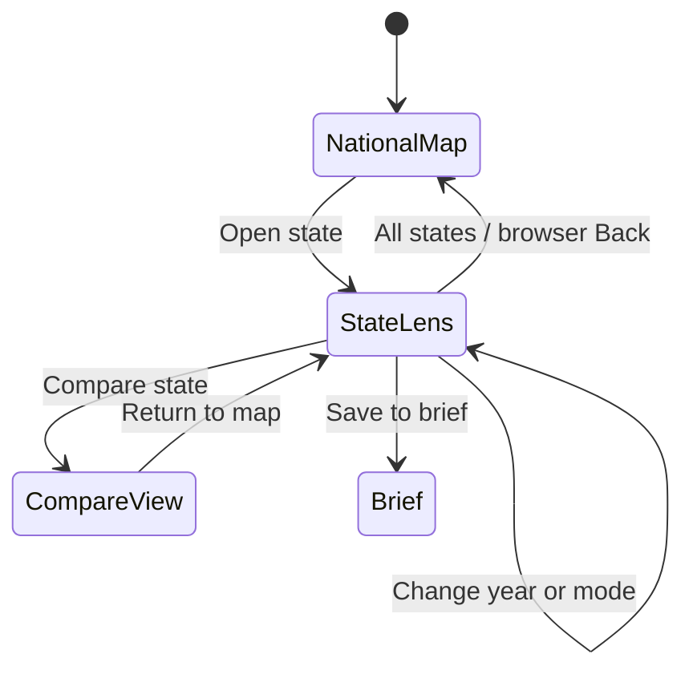

# State map drill-down plan

Drafted 2026-07-18. This is an implementation-ready product and UX plan, not an
engineering commitment. It assumes one primary maintainer and the existing
framework-free national FARS evidence studio.

## Executive recommendation

Build a two-level map experience:

1. **National map — find a jurisdiction.** Preserve the current comparable,
   mode-specific US overview.
2. **State lens — inspect the selected jurisdiction.** Replace the national map
   in place with a state-focused evidence sheet: selected-year mode profile,
   five-year visual history, publication status, coding-regime seam, provenance,
   comparison, and brief actions.

Ship the state lens first using only the reviewed artifacts already loaded by the
site. Do not imply that zooming the state outline reveals county, city, corridor,
or risk detail that the current data does not contain.

Treat **county drill-down** as a separately gated second release. It requires a
new state-sharded county artifact, a county-boundary contract, annual county-code
mapping verification, small-cell publication rules, accounting proofs, and user
validation. It must remain a fatal-crash burden view, not an exposure-normalized
risk map.

The distinctive interaction should be the **evidence seam**: a visible break
between 2020–2021 and 2022–2024 that keeps the reviewed FARS person-type coding
change attached to every visual comparison. The feature should feel like opening
a surveyed evidence sheet, not entering a generic map dashboard.

## Why this is worth building

The current studio already has most of the underlying behavior:

- a verified national state-boundary artifact;
- 51 reviewed jurisdictions and six involved-mode cells per annual artifact;
- five annual releases from 2020 through 2024;
- state selection from the map, matrix, rank, scatter, comparison, and filter;
- a selected-year six-mode inspector;
- a five-year state table with the coding-regime seam;
- state comparison, saved brief items, English/Spanish copy, URL restoration,
  roving keyboard focus, suppression handling, and request-race protection.

The problem is spatial continuity. Selecting a state changes the inspector and a
table farther down the page, but the map remains national. The user does not feel
that they entered the state, the strongest evidence stays scattered across the
page, and the five-year profile is visually weak despite being one of the most
useful and carefully qualified parts of the product.

This feature is useful only if it helps a user answer a concrete question:

> “What does the reviewed FARS record show for this state, how did the published
> burden differ by involved mode and year, what is withheld, and what can I cite
> without turning counts into a safety claim?”

## Product fit and boundaries

The drill-down belongs inside the **Atlas** reference surface described in the
[product expansion plan](PRODUCT-EXPANSION-PLAN.md). It supplies official-outcome
context for a Decision Dossier; it is not the dossier, a local near-miss analysis,
or an intervention recommender.

### Goals

1. Let a keyboard, pointer, or touch user move from the US overview to a useful
   state evidence view in one deliberate action.
2. Put the selected year, six involved modes, five-year history, publication
   limits, coding seam, and source contract in one coherent visual hierarchy.
3. Preserve selection and navigation in a shareable URL and browser history.
4. Make suppression, zero, missingness, and loading visibly distinct without
   exposing an unpublished number.
5. Give advocates, planners, researchers, and journalists a faster path from map
   selection to a citable, correctly qualified reference.

### Non-goals for the first release

- County, city, tract, crash-point, or corridor geography. The current public
  artifact has no reviewed sub-state projection.
- Pan-and-zoom map controls. Magnification without new information is not a
  drill-down.
- Exposure-normalized risk, “safest/most dangerous” labels, causal language, or
  treatment recommendations.
- A stacked or pie visualization that implies the six overlapping modes add to a
  total.
- Continuous trend lines across the 2021/2022 coding seam.
- New frameworks or a client-side mapping dependency for the state-lens release.
- Automatic publication of a state selection to a dossier or public registry.

## Primary users and stories

### Safe-streets advocate

- As an advocate, I want to open my state from the national map so that I can
  understand the official fatal-crash context before making a corridor claim.
- As an advocate, I want to save the state and active mode to a brief so that the
  source and caveat travel with the number.

### Planner or engineer

- As a planner, I want to see annual values and the coding seam together so that I
  do not mistake a contract change for an uninterrupted trend.
- As a planner, I want to compare a state with another state as burden counts,
  with the lack of exposure normalization made explicit.

### Researcher or journalist

- As a researcher, I want a stable URL that restores state, year, mode, language,
  and drill-down level so that another person can inspect the same view.
- As a journalist, I want withheld cells labeled as unpublished rather than zero
  so that I do not report a fabricated absence.

### Keyboard or screen-reader user

- As a keyboard user, I want one map tab stop and predictable arrow-key movement,
  followed by an explicit action to enter or leave a state lens.
- As a screen-reader user, I want the state lens announced as a new region with a
  concise summary and a complete data table equivalent.

## Experience model

### Navigation state

Add one independent state field:

```text
viewState.mapLevel = "national" | "state"
```

`selectedState` answers “which jurisdiction is active.” `mapLevel` answers
“which geographic context is being shown.” Keeping them separate prevents a
selection in the comparison view from unexpectedly navigating the map.



### Desktop composition

```text
┌ All states / California ───── 2024 · Pedalcyclist ── Copy view ┐
│                                                                │
│  ┌ STATE SILHOUETTE ──────┐  CALIFORNIA                       │
│  │                         │  Published count + exact status    │
│  │      CA                 │  Source / release / contract       │
│  │                         │                                   │
│  └─────────────────────────┘  Six mode-specific survey strips  │
│                                                                │
│  2020  2021  ║  2022  2023  2024  ← visible evidence seam     │
│  ●      ●     ║    ●     ●     ●    selected mode              │
│                                                                │
│  Counts are burden, not risk. Modes overlap. [Compare] [Save]  │
└────────────────────────────────────────────────────────────────┘
```

The state silhouette is orientation, not the main result. The evidence board is
the main result. On wide screens use a 5/7 split; on medium screens use a 4/8
split. Keep the existing Atlas paper, ink, measured blue, signal red, centerline
amber, rule, and white sheet tokens. Continue Overpass for headings, Atkinson
Hyperlegible Next for prose, and Fragment Mono for data and contracts.

### Mobile composition

Use an inline page state, not a modal drawer:

```text
[← All states]  California
[state silhouette]
[year] [mode]
[selected result + status]
[six mode rows]
[five-year evidence-seam strip, horizontally scrollable if needed]
[claim boundary]
[Compare] [Save to brief]
```

The back control stays first in focus order. The state name and active result
remain visible before the longer profile. No hover-only content is permitted.

### The evidence seam

The five-year view must not use one connected line from 2020 to 2024. Use five
aligned points or bars with a physical gutter and labeled divider between 2021
and 2022:

```text
Earlier coding        Later coding
2020   2021      ║    2022   2023   2024
```

This is the feature’s signature visual because it encodes a true property of the
source. It should appear in the visual view, accessible table, legend, Spanish
copy, print treatment, and exported brief language.

## Core interaction flow

1. The national map loads exactly as it does today.
2. A state group retains its accessible name, selected-year count/status, active
   mode, and roving `tabindex` behavior.
3. Click/tap or Enter/Space on a state opens the state lens in place.
4. Focus moves to the state-lens heading after pointer-independent activation.
   The heading announces state, year, active mode, and publication status.
5. The selected-year evidence renders immediately from the active artifact.
6. The five-year visual shows a loading state while the existing annual artifact
   promises resolve. It never shows the previous state during a pending request.
7. Changing year or mode updates the state lens without leaving it. The state
   outline does not animate again for filter-only changes.
8. “All states” returns to the national view and restores focus to the state that
   opened the lens. Browser Back performs the same transition.
9. “Compare” opens the existing comparison view with the selected state in slot A.
10. “Save to brief” reuses the existing saved-state behavior and live-region
    confirmation.

Avoid double-click, hover-to-open, scroll-wheel zoom, or an unlabeled chevron as
the only entry mechanism.

## Information hierarchy inside the state lens

### 1. Context bar

- Breadcrumb: “All states / California.”
- Selected year and active involved mode.
- Copy-view action.
- Release-stage badge.

### 2. Active result

- State name and postal abbreviation.
- Published count or the full “suppressed or zero — not numerically published”
  status.
- Exact involved-mode label.
- Burden rank only if numeric, labeled “rank by published count,” never “safety
  rank.”
- Source name, release stage, annual mapping-contract revision, and dataset year.

### 3. Six-mode fingerprint

Show six horizontal rows. Each row has its own national same-mode scale, matching
the matrix’s current scale semantics. Do not share a cross-mode scale and do not
stack rows.

Each row contains:

- mode label;
- published count or withheld status;
- same-mode national scale track;
- text status and pattern parity;
- selected-row indicator.

### 4. Five-year visual profile

- Five discrete annual marks for the active mode.
- A visible coding-seam divider.
- Exact values in an adjacent or expandable accessible table.
- Suppressed-or-zero marks rendered as hatch/status, never at numeric zero.
- No percent-change callout across the seam.
- Optional within-regime difference language only after a separate methods review.

### 5. Claim boundary and actions

Keep the caveat immediately beside the evidence:

> Counts describe reviewed fatal-crash burden. They do not account for exposure
> and do not establish risk, fault, causation, or treatment effect. Modes overlap.

Actions: Compare state, Save to brief, Open full ledger, Inspect source contract.

## Functional requirements

### P0 — state lens release

#### P0.1 Geographic navigation

- Add national/state map-level state without coupling it to ordinary selection.
- Open the state lens from pointer, touch, and keyboard activation.
- Provide “All states” and browser-history return paths.
- Restore focus to the originating state on return.

Acceptance criteria:

- Given the national map is active, when a user activates California, then the
  map region shows the California state lens and the lens heading receives focus.
- Given the state lens is active, when the user activates “All states,” then the
  US map returns and California is the roving-tabindex target.
- Given a shared state-lens URL, when it loads, then the same state, year, mode,
  language, view, and map level are restored.

#### P0.2 Visual evidence sheet

- Render active result, six-mode fingerprint, and five-year discrete profile.
- Use the existing annual artifacts; calculate no new public statistic.
- Preserve per-mode scale independence and non-additive language.
- Make the 2021/2022 contract seam structural, not a tooltip footnote.

Acceptance criteria:

- Every visible number can be traced to one existing published artifact cell.
- A withheld cell has no numeric DOM text, ARIA label, data attribute, tooltip, or
  CSS custom property derived from its hidden value.
- No line, area, or stacked chart visually bridges the contract seam.

#### P0.3 Progressive loading and race safety

- Render selected-year evidence without waiting for all five artifacts.
- Reuse cached annual promises for the five-year profile.
- Retain request serials or an abort mechanism for rapid state/year/language
  changes.
- Expose loading, ready, partial, and error states in text and `aria-busy`.

Acceptance criteria:

- Rapidly selecting California and then New York never exposes California in the
  New York lens while a request is pending.
- One annual-artifact failure leaves selected-year evidence usable and explains
  which part of the five-year profile could not load.
- Retrying the profile does not reload already verified artifacts.

#### P0.4 URL and history contract

Extend the current query contract with:

```text
level=state
state=CA
```

Omit `level` for the national default. Continue using existing `year`, `mode`,
`view`, `lang`, comparison, scale, and saved-state parameters. Use `pushState`
when crossing national/state levels and `replaceState` for filters within a level.

Acceptance criteria:

- Browser Back leaves the state lens before leaving the Atlas page.
- Invalid, duplicate, or unsupported `level` values fail through the existing
  strict URL-validation path.
- Copy view produces a canonical restorable URL without transient loading state.

#### P0.5 Responsive and accessible behavior

- Preserve the current one-tab-stop map pattern and arrow navigation.
- Give the state lens a labeled region and programmatic heading.
- Provide complete table parity for the six-mode and five-year visuals.
- Use logical CSS properties and retain the authored RTL smoke gate.
- Respect reduced motion; the lens transition becomes immediate when requested.
- Maintain at least 44 CSS-pixel touch targets for new primary controls and the
  existing contrast floor.

Acceptance criteria:

- Axe reports no violations on national and state-lens fixtures.
- A manual VoiceOver and NVDA pass can enter a state, understand the active result,
  reach the complete table, and return to the US map.
- At 320 CSS pixels no control or essential value is clipped; tables use labeled
  scroll regions.
- At 200% zoom the interaction remains operable without two-dimensional page
  scrolling.

#### P0.6 English and Spanish parity

- Add every new label, state, empty, error, caveat, history, and live-region
  message to both catalogs in the same change.
- State names remain sourced from the reviewed state inventory.
- Copy-view URLs preserve `lang`.

### P1 — fast follows

- Pin up to four state lenses as small evidence cards in the existing brief.
- Print a state evidence sheet with source, seam, values, and caveat.
- Add a “return to previous analytic view” link from the state lens.
- Add optional national same-mode percentile language only after methods review;
  retain “burden, not risk.”
- Add a short state-search combobox if observed users struggle with the current
  select at 51 jurisdictions.
- Add a restrained 180–240 ms viewBox/opacity transition that preserves focus and
  disappears under `prefers-reduced-motion`.

### P2 — county lens, gated new data product

Only proceed if observed users need to identify a county-level official-outcome
context and understand the limits of count data.

Build:

- a state/year index that points to state-sharded county-mode artifacts;
- verified annual FARS county-code mappings, including unknown/not-reported
  accounting;
- simplified, state-sharded Census county boundaries with source hash, vintage,
  byte length, topology checks, and state/county join proof;
- distinct-fatal-crash-once-per-involved-mode aggregation by county;
- effective publication floor and explicit `published` versus
  `suppressed_or_zero` status;
- state totals reconciled to county totals plus declared unknown-county buckets;
- county search and a county evidence sheet using the same claim boundary.

Do not publish crash points in this flow. Do not label a county hot spot or risk
priority without an appropriate exposure denominator and a separately reviewed
method.

## Technical design

### Reuse before adding

Keep the current static, framework-free architecture:

- `web/us-coverage.js` remains the state machine and renderer for P0.
- `web/us-coverage.html` receives a semantic state-lens container and accessible
  table fallback.
- `web/us-coverage-studio.css` owns the state-lens composition and transitions.
- Existing release-index, artifact, boundary, i18n, comparison, brief, and URL
  functions remain the source of truth.
- `web/us_coverage_check.mjs` expands to cover map-level navigation, history,
  loading races, suppression, i18n, focus, and deep links.

Do not add Leaflet, Mapbox GL, D3, or another client dependency for P0. The current
SVG projector already computes a fitted state path. A state lens can fit the one
selected feature to a state viewport and reuse the existing geometry validation.

### Proposed modules inside the current file

Keep functions small even if the build remains one script:

```text
parseMapLevel(params)
enterStateLens(abbreviation, source)
leaveStateLens(options)
syncMapHistory(transition)
renderNationalMap()
renderStateLens()
buildStateLensModel(abbreviation, year, mode)
renderModeFingerprint(model)
renderFiveYearProfile(model)
restoreMapFocus(abbreviation)
```

`buildStateLensModel` should be a pure function with no DOM reads. It returns only
validated, public values and display statuses, making suppression leakage and unit
testing easier to control.

### State-lens model

```text
state identity
active year and release contract
active mode cell
six selected-year public cells
five annual public cells for the active mode
coding-regime group for each annual cell
same-mode published national maximum and burden rank
loading/error status by annual artifact
claim-boundary and source keys
```

No hidden count should enter this model.

### Performance budget

- Selected-year state lens interactive within 100 ms after activation when the
  annual artifact and boundaries are already loaded.
- No new blocking request for the selected-year view.
- Five-year profile ready within 1 second at p75 after activation on a warm cache;
  selected-year content remains usable while it loads.
- P0 JavaScript increase under 18 KiB uncompressed and CSS increase under 12 KiB.
- No layout shift after the selected-year lens appears; reserve profile space or
  use a stable inline loading panel.

### Security and integrity

- Continue exact path allowlisting and hash/byte validation for every annual
  artifact and boundary file.
- Build DOM through `textContent`/element creation; do not introduce HTML string
  interpolation for state or source values.
- Reject invalid state, map-level, year, mode, and duplicate URL parameters.
- Preserve content-security and static-hosting assumptions.

## Testing strategy

### Model and data tests

- State-lens model for published and suppressed cells.
- Per-mode scale independence.
- Rank absent for withheld cells.
- Five-year grouping on the correct side of the seam.
- Missing annual artifact produces partial status without stale values.
- All 51 jurisdictions fit a valid state viewport.

### DOM contract tests

- National → state → national navigation.
- Direct state-lens URL restoration.
- Back/forward history behavior.
- Focus movement and restoration.
- Rapid state, year, mode, and language races.
- Copy-view contract.
- No unpublished numeric leakage in text, attributes, SVG, tables, or CSS.
- English/Spanish semantic parity.
- Reduced-motion path.

### Visual regression matrix

Capture stable screenshots at:

- 1440×900 desktop: California, Rhode Island, Alaska, Hawaii, and DC;
- 1024×768 compact desktop/tablet;
- 390×844 and 320×568 mobile;
- published and suppressed active cells;
- early/later coding regimes;
- English and Spanish;
- 200% zoom and forced-colors mode.

Choose geographically difficult states deliberately: Alaska and Hawaii exercise
insets, DC/Rhode Island exercise tiny geometry, and California/Texas exercise long
labels and large counts.

### Manual usability and accessibility tasks

Ask at least six participants to:

1. Open a named state from the map.
2. Identify the active year and involved mode.
3. Explain what a withheld cell means.
4. Compare 2021 with 2022 and state the coding caveat.
5. Return to the national map.
6. Copy and reopen the same view.
7. Save the state to a brief.

Include at least one keyboard-only user and one screen-reader user before public
release.

## Delivery plan

### Phase 0 — prototype and validate the task (3–5 days)

- Build a static or branch-only state-lens prototype from existing California,
  Rhode Island, Alaska, and suppressed-cell fixtures.
- Test with 5–7 target users using the tasks above.
- Validate that the lens helps them answer a question rather than merely feeling
  more interactive.
- Decide whether map activation should enter immediately or first show an explicit
  “Open state lens” action. Default recommendation: immediate entry from the map,
  explicit entry from non-map views.

Exit gate: at least five of six users find the five-year profile and correctly
state that the view shows burden counts, not risk.

### Phase 1 — navigation and state model (3–4 days)

- Add `mapLevel`, strict URL parsing, push/replace history behavior, and focus
  restoration.
- Split national-map rendering from state-lens rendering.
- Add pure state-lens model tests before visual implementation.

Exit gate: direct links, Back/Forward, pointer, touch, and keyboard transitions pass
without stale state.

### Phase 2 — evidence-sheet UI (5–7 days)

- Build the desktop and mobile state-lens compositions.
- Add fitted state geometry, active result, six-mode fingerprint, evidence seam,
  accessible tables, caveat, provenance, compare, and brief actions.
- Add English/Spanish copy in the same pull request.

Exit gate: every state renders; no published value or status disagrees with the
current inspector/profile; suppression audit passes.

### Phase 3 — hardening and release (3–5 days)

- Expand jsdom contracts and data tests.
- Add visual regression fixtures and manual accessibility review.
- Run performance budgets and rapid-change race tests.
- Release behind a query-controlled preview only if usability or accessibility
  issues remain; otherwise replace the current map selection behavior directly.
- Verify exact live bytes and deep links on both public hosting targets.

Exit gate: all CI, manual accessibility tasks, deep-link checks, and production
artifact verification pass.

### Phase 4 — evaluate county demand (1–2 weeks of discovery)

- Observe how state-lens users try to answer sub-state questions.
- Collect the exact county-level decisions and required source artifacts.
- Prototype one state with deliberately difficult county codes and suppressed
  cells.
- Write an ADR and public artifact schema before building nationwide coverage.

Exit gate: at least three real users need county context for a named decision and
can correctly explain why county counts are not local risk.

## Work breakdown

| Work item | Size | Depends on |
| --- | ---: | --- |
| Map-level state + URL/history contract | M | Existing URL state |
| Pure state-lens model | M | Annual artifacts |
| Fitted selected-state SVG | S | Boundary projector |
| Desktop evidence-sheet layout | M | Model + selected SVG |
| Mobile state-lens layout | M | Desktop semantics |
| Six-mode fingerprint | M | Per-mode summaries |
| Five-year evidence-seam visual | M | Annual artifact cache |
| Loading/error/partial states | M | Request serials |
| Compare/brief integration | S | Existing actions |
| English/Spanish catalog additions | M | Final UX copy |
| URL/history/focus contract tests | M | Navigation state |
| Suppression and race regression tests | M | State model |
| Manual accessibility review | M | Feature-complete preview |
| County artifact discovery and ADR | L | Validated county demand |

## Success metrics

### Leading indicators, measured in observed sessions

- At least 80% of participants open a named state without instruction.
- At least 80% find the selected-year mode count and five-year view within 30
  seconds.
- At least 80% correctly explain “suppressed or zero” after using the lens.
- At least 80% correctly state that counts are not exposure-normalized risk.
- At least 5 of 6 participants recognize the 2021/2022 coding seam before making a
  cross-year claim.
- Median time to copy a restorable state-lens URL is under 45 seconds.

### Lagging indicators, evaluated after 30–60 days

- At least 25% of state-lens sessions use Compare, Save to brief, Copy view, or
  Inspect source—evidence of a task beyond visual browsing.
- At least three real dossiers or partner workflows cite a state-lens view as
  official-outcome context.
- Fewer than 5% of observed tasks end in confusion between burden and risk.
- Zero suppression leaks, broken deep links, or accessibility regressions.

Telemetry must remain privacy-safe and opt-in where required. Do not record free
text or local project data. Aggregate map-level entry, state-lens ready, compare,
save, copy, return, error, and profile-load timing events. State identity can be
omitted from telemetry unless a documented measurement need justifies it.

## Risks and mitigations

| Risk | Mitigation |
| --- | --- |
| Users interpret zoom as finer geographic evidence | Label “State evidence view”; show no county detail in P0; state the geographic unit beside the heading. |
| Counts become a safety ranking | Keep “burden, not risk” adjacent; never use safest/dangerous language; preserve mode-specific scales. |
| Five-year marks imply a continuous trend | Use discrete marks and a structural evidence seam; prohibit a connected line across regimes. |
| Suppressed cells appear as zero | Use status objects, hatching, text parity, and DOM leakage tests. |
| State selection races expose stale data | Keep request serials/abort behavior and add rapid-change contracts. |
| Large states dominate visual hierarchy | State silhouette is orientation only; evidence uses consistent layout across states. |
| Tiny states are hard to activate | Preserve locator treatment, search/filter access, and accessible roving groups. |
| County expansion becomes a nationwide data project too early | Gate it on real user decisions and require a schema/ADR/prototype first. |
| UI becomes another generic analytics dashboard | Make the evidence seam the single signature; reuse Atlas survey/ledger language and remove decorative metrics. |

## Open questions

### Blocking before implementation

1. **Product/design:** Should a single map activation enter the state lens, or
   should the first activation select and a second explicit action enter? Test both
   in Phase 0; recommended default is immediate map entry.
2. **Product:** Is the primary task state research, citation, or adding official
   context to a Decision Dossier? The ordering of actions depends on this.
3. **Accessibility:** Should focus land on the state-lens heading or the “All
   states” control? Test with screen-reader and keyboard users.

### Non-blocking during implementation

4. **Design:** Whether the six-mode fingerprint belongs beside the state silhouette
   or immediately below the active result at 1024–1199 CSS pixels.
5. **Engineering:** Whether `pushState` transitions should store the originating
   focus key or derive it from `selectedState`.
6. **Data/methods:** Whether within-regime differences may be described in plain
   language without a formal trend statistic.
7. **Product/data:** Whether county demand clears the Phase 4 gate; do not assume it
   will.

## Recommended decision

Approve Phases 0–3 as one state-lens initiative using existing data. Hold county
drill-down behind its own discovery gate and ADR. The result should make state
selection materially more useful, more visual, and easier to cite while preserving
the project’s strongest differentiator: the caveat and source contract remain
attached to the evidence at every level.
